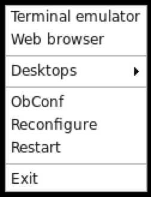

## Pure Ubuntu 16.04 + ROS + Sawyer &amp; Gazebo + VNC & openbox

This repository contains a Dockerfile for building ROS and Sawyer packages on top of pure Ubuntu 16.04 docker image (with openbox window manager), which runs in a headless mode, and is viewed through the vnc.


## Build manually


## Using perr-built image from [Docker hub]([https://hub.docker.com/r/mksmsrkn/pure_ubuntu_ros_sawyer/]).
You can download prebuilt image from the docker hub by running:
```# docker pull mksmsrkn/pure_ubuntu_ros_sawyer```


## Building manually

To build manually, pull the repo:

```bash
git pull mksmsrkn/pure_ubuntu_ros_sawyer
cd pure_ubuntu_ros_sawyer
chmod u+x bootstrap.sh
docker build -t pure_ubuntu_ros_sawyer .
```

Building was succesfully tested on Mac OS X Mojave Version 10.14 and Ubuntu 18.04 Docker hosts.


## Running to image

To run the container enter:

```bash
docker run -d -p 5900:5900 mksmsrkn/pure_ubuntu_ros_sawyer
```

OR if you were build it yourself:

```bash
docker run -d -p 5900:5900 pure_ubuntu_ros_sawyer
```

## Connect

You can use any VNC viewer of your choice to connect to the image.

VNC address: `localhost` OR `0.0.0.0` OR `127.0.0.1` (other of these would work)

VNC port: `5900` 
(if you prefer to use another port replace the first -p value when running docker run `-p $PORT:5900`)

After connecting you will see a black screen, you can make a right click to see the dropdown window managep menu, which looks as following:



You can open Terminal emulator (which is a Terminator by default).

You will need to edit intera.sh file first, which is located in `ros_ws/intera_sdk/` folder.
Set `robot_hostname` to your container id, you can learn it by running `hostname` in terminator.
Set `your_ip` to dockers ip, you can look it up calling `ifconfig`.
Set `ros_version` to `kinetic`.
Done!

Now copy/move `intera.sh` to `~/ros_ws/`.

To run Gazebo simulator example simply run: 

```bash
./intera.sh
roslaunch sawyer_sim_examples sawyer_pick_and_place_demo.launch
```

It may take a little while to open it, but then should be able to see the robot moving a red box around the table.
